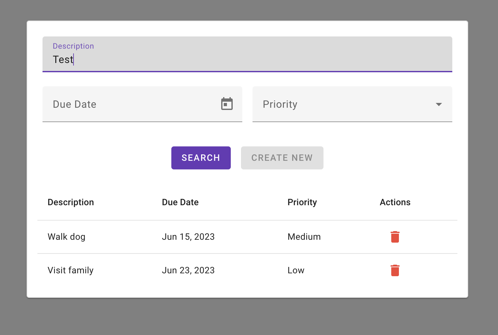

# Angular Todo List

This project is an Angular application that provides a page for listing and managing todo items. Each item consists of a description, a due date, and a priority. The page allows filtering of the items based on their description and/or priority.

  

## Development Process

The project was developed using Angular, Angular Material, Express, Node.js, and flat file storage. The development followed a mobile-first approach and utilized SCSS for styling. API calls were made using RxJS. The SCSS styles followed the BEM (Block Element Modifier) and OOCSS (Object-Oriented CSS) methodologies.

## Getting Started

To run the project locally, follow these steps:

1. Install dependencies by running `npm install`;
2. Start the server by navigating to the `server/` directory and running `npm run server`;
3. Start the web application by navigating to the `web/` directory and running `npm run web`;
4. Open your web browser and navigate to `http://localhost:4200/`.

## Challenges

The time constraint of completing the project within two hours posed a challenge. Given more time, there could have been additional features and improvements implemented.

## Future Implementations

The following are some of the planned future enhancements for the project:

- Mark items as done/undone;
- Implement unit tests;
- Refactor code into more modular components;
- Make the table responsive;
- Include a confirmation dialog for deleting items.
